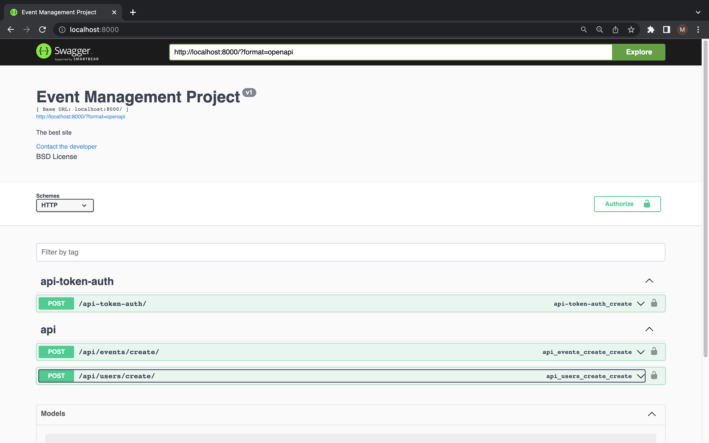
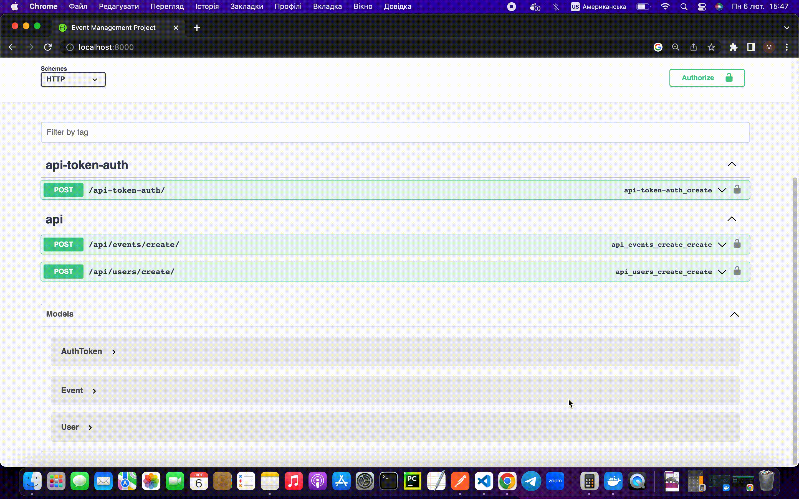
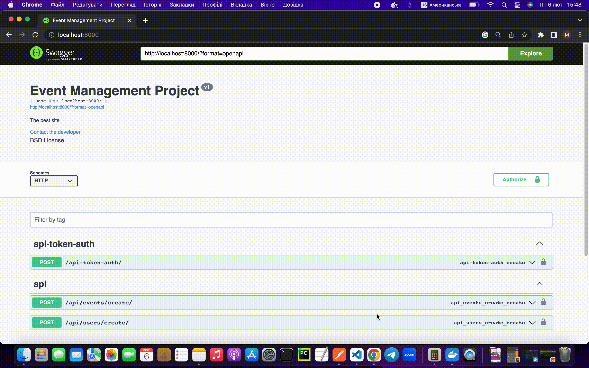

# Event management project (Test Task)

My project was created in order to help authenticated users create events for specific datetime with some information and type events.

[](https://img.shields.io/github/languages/top/Misha86/EventManagement)
[](https://visitor-badge.laobi.icu/badge?page_id=Misha86Event.Management)

[](https://github-readme-stats.vercel.app/api?username=anuraghazra&show_icons=true&hide=contribs>,prs&cache_seconds=86400&theme=default_repocard)

---
Content

- [Installation](#installation)
  - [Clone](#clone-or-download)
  - [Required to install](#Required-to-install)
  - [Environment](#environment)
  - [How to run local](#How-to-run-local)
  - [How to run Docker](#how-to-run-docker)
  - [Setup using the terminal](#setup-using-the-terminal)
  - [Setup using docker](#setup-using-the-docker)
- [Tests](#tests)
- [Usage](#usage)
- [Team](#team)

---

## Installation

### Clone or Download

- Clone this repo to your local machine using

```bash
git clone https://github.com/Misha86/EventManagement.git
```

  or download the project archive: <https://github.com/Misha86/EventManagement/archive/refs/heads/main.zip>

<a name="footnote">*</a> - to run the project you need an `.env` file in root folder

### Required to install

- [](https://www.python.org/downloads/release/python-3109/) 3.10
- Project requirements:

```bash
pip install -r requirements.txt
```

### Environment

- Add the environment variables file (.env) to the project folder.
It must contain the following settings:

```python
SECRET_KEY = '😊YOUR_SECRET_KEY😊'
DEBUG = False 
ALLOWED_HOSTS = *
```

### How to run local

- Start the terminal.
- Go to the directory "your way to the project" EventManagement / event_management
- Run the following commands

```bash
python manage.py makemigrations
python manage.py migrate
python manage.py collectstatic --no-input
python manage.py runserver
```

###

### How to run Docker

- Go to the main directory - EventManagement
- Create Docker image

```bash
docker build -t event_image .
```

- Run the project using Docker event_image

```bash
docker run -dp 8000:8000 -v $(pwd)/event_management/db.sqlite3:/src/db.sqlite3 --name event_container --rm event_image
```

###

### Setup using the terminal

- Go to the event_management directory
- Create a superuser:

```bash
python manage.py createsuperuser
```

###

### Setup using the docker

- Run or start the container if it was stopped
- Create a superuser

```bash
docker exec -it event_container python manage.py createsuperuser
```

Stop Docker container

```bash
docker stop event_container  
```

---

## Tests

The project uses Factory Boy for tests

- Go to the directory "your way to the project" EventManagement / event_management
- Run project tests:

```bash
python manage.py test
```

## Using flake8

- Install flake8 according to python version:

```bash
pip install flake8
```

- Install flake8 extensions:

```bash
pip install -r requirements-flake8.txt
```

- Install pre-commit:

```bash
pip install pre-commit
```

- Make sure there are files `.flake8` & `.pre-commit-config.yaml` in the project
directory

- Create hook:

```bash
pre-commit install
```

- Settings are ready to use. Before committing, the hook will run
a flake8 check. If the check does not pass the commit will not take place.

---

## Using coverage

- Install coverage according to python version:

```bash
pip install coverage
```

- Run tests coverage from main directory:

```bash
coverage run event_management/manage.py test event
```

- Check coverage report:

```bash
 coverage report
```

- Create html coverage report:

```bash
 coverage html
```

- Open html report file in the browser:

```bash
 ./htmlcov/index.html
```

---

## Usage

Endpoints in the project you can use in the frontend part, Postman or Swagger. I installed Swagger that user can test them.

- Run server

```bash
python manage.py event_management/manage.py runserver
```

or

```bash
docker run -dp 8000:8000 -v $(pwd)/event_management/db.sqlite3:/src/db.sqlite3 --name event_container --rm event_image
```

- Open in the browser URL <http://localhost:8000> (Swagger API)

[](http://localhost:8000)

### Create user

Only authenticated users can create events.

- Use URL <http://localhost:8000/api/users/create>


### Create token

- Use URL <http://localhost:8000/api-token-auth>



### Authorize user

Set user token key into the request header.



### Create a new event

- Use URL <http://localhost:8000/api/events/create>


### Review Redoc

Redoc is an open-source tool for generating documentation from OpenAPI (Swagger) definitions.

By default Redoc offers a three-panel, responsive layout:

- The left panel contains a search bar and navigation menu.
- The central panel contains the documentation.
- The right panel contains request and response examples.

- Use URL <http://localhost:8000/redoc>


---

## Team

### Development team

[](https://github.com/Misha86)

---
